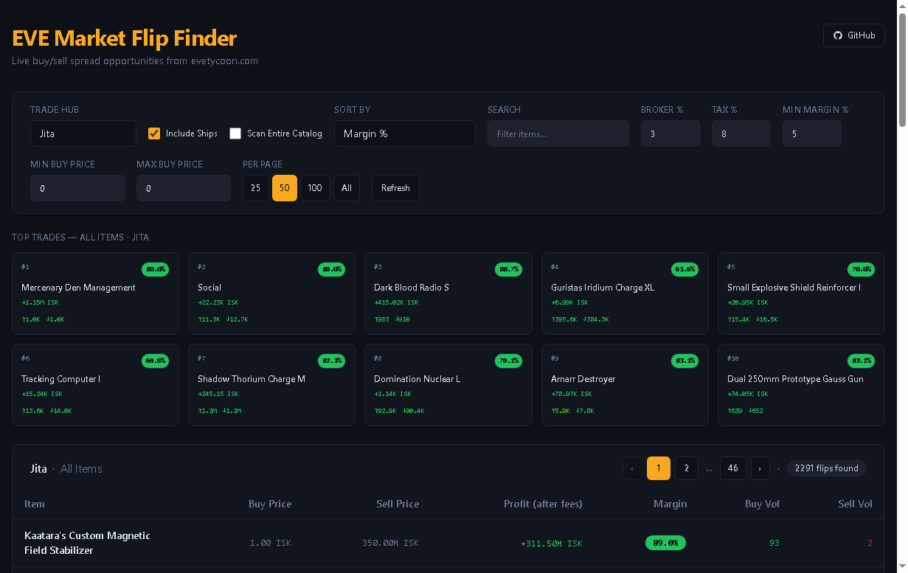

# EVE Market Flip Finder

A live market tool for finding buy/sell spread opportunities in EVE Online. Pulls real-time data from [evetycoon.com](https://evetycoon.com) and surfaces the most profitable station trades across the major trade hubs — as a web app **and** a Windows desktop app that links to your EVE character and actively monitors your orders.



> **Branch note:** `testing` is the **desktop (Electron) build** — it contains everything the web version has plus the linked-account Trader Dashboard, live order monitoring, and auto-update. `main` is the stable **web-only** version. This README documents the `testing` build.

## Two ways to run it

| | Web | Desktop (this branch) |
|---|---|---|
| Market flip finder | ✅ | ✅ |
| Full-catalog scan + search | ✅ | ✅ |
| Link EVE character | ❌ | ✅ |
| Live order monitor (fills / undercuts) | ❌ | ✅ |
| Desktop notifications + clipboard price | ❌ | ✅ |
| "Cancel" weak-buy-order list | ❌ | ✅ |
| Open market window in the EVE client | ❌ | ✅ |
| Auto-update | ❌ | ✅ |

## Features

### Market finder (web + desktop)
- **Live market data** — current buy/sell orders across Jita, Amarr, Dodixie, Rens, and Hek.
- **Flip analysis** — best buy, best sell, profit in ISK, and margin % per item, **after** configurable broker fee (default 3%) and sales tax (default 8%).
- **Buy & sell volume** — daily trade volume for each side separately, colour-coded red→green relative to the other side so the slower-filling leg of a flip is obvious at a glance.
- **Top Trades** — the best current opportunities, scored by margin weighted by liquidity **and** volume balance, so high-margin items with dead or one-sided volume don't float to the top.
- **Category filtering** — browse by ship class, turrets, ammo, modules, drones, rigs, implants, skillbooks, industry, and more. Toggle ships in/out.
- **Scan Entire Catalog** — one toggle scans all ~19k marketable items instead of the curated categories. First scan takes a couple of minutes; a progress counter shows how far along it is.
- **Full-catalog search** — the search box autocompletes against every item in the game, not just what's currently on screen; picking one fetches its live stats on demand for the selected hub.
- **Sorting & pagination** — sort by margin, profit, liquidity, or either volume; page sizes 25 / 50 / 100 / All.

### Desktop-only — Trader Dashboard
Once you link an EVE character (OAuth2 PKCE — no client secret, tokens stored locally):
- **Live order monitor** — polls every 5 minutes (matches ESI's order cache) and detects:
  - **Fills** — an order that disappeared and isn't in your cancel/expire history was filled; on a buy fill it copies a suggested sell price to your clipboard.
  - **Undercuts** — someone out-bid your buy order or under-cut your sell; copies the price you'd need to reclaim top-of-book.
- **Tick-size aware pricing** — suggested prices respect EVE's magnitude-scaled market tick (0.01 ISK below 1000, up to 1000 ISK at 1M+) instead of a flat 0.01.
- **Cancel tab** — ranks your **weakest buy orders** — the ones worth cancelling so the ISK can chase a better flip. The primary signal is *dead flip margin*: if you re-bid to stay top-of-book, what post-fee margin is left versus the current sell-out price (the robust average of the lowest 5% of sell orders)? Orders are flagged when that margin drops below your Min Margin (or goes negative), when you're buried >5% below the top buy, or when they're stale (>3 days old and barely filled). Advisory only — it links you out to cancel in-client.
- **Open in EVE** — opens the market window for any item directly in your running EVE client.
- **Desktop notifications** for new fills and undercuts.

## Install the desktop app

Download the latest `EVE Flip Finder Setup x.y.z.exe` from the [**Releases**](https://github.com/Kudretg/eve-flip-finder/releases) page and run it. Windows SmartScreen may warn about an unknown publisher (the build is self-signed) — click through to install. The app auto-updates from GitHub Releases on launch and via **Help → Check for Updates…**.

### Linking your EVE account

The monitor needs a CCP developer application (free):

1. Go to [developers.eveonline.com](https://developers.eveonline.com/) → **Manage Applications** → **Create New Application**.
2. Set the **Callback URL** to exactly:
   ```
   http://localhost:3456/callback
   ```
3. Grant these scopes:
   - `esi-wallet.read_character_wallet.v1`
   - `esi-markets.read_character_orders.v1`
   - `esi-ui.open_window.v1`
4. Copy the app's **Client ID** into the Trader Dashboard, click **Link EVE Account**, and authorize in the browser window that opens.

> If you linked before the `esi-ui.open_window.v1` scope was added, **Unlink** and re-link to grant it, otherwise "Open in EVE" will fail with a scope error.

## Running from source

```bash
npm install

# Web (Vite dev server at http://localhost:5173)
npm run dev

# Desktop app in dev (compiles electron/, starts Vite, launches the window)
npm run electron:dev

# Build the Windows installer → release/EVE Flip Finder Setup x.y.z.exe
npm run electron:build

# Regenerate the item catalog after a game patch
npm run sync:items
```

## Stack

- Vite + React 19 + TypeScript (strict)
- Electron 42 (desktop), `electron-store` + `electron-updater`
- TanStack Query v5 for fetching and caching
- Tailwind CSS v4
- Market data from [evetycoon.com](https://evetycoon.com) (no API key required); character data via EVE ESI.

## Disclaimer

Not affiliated with CCP Games. All trade suggestions are informational — verify prices in-client before committing ISK.
